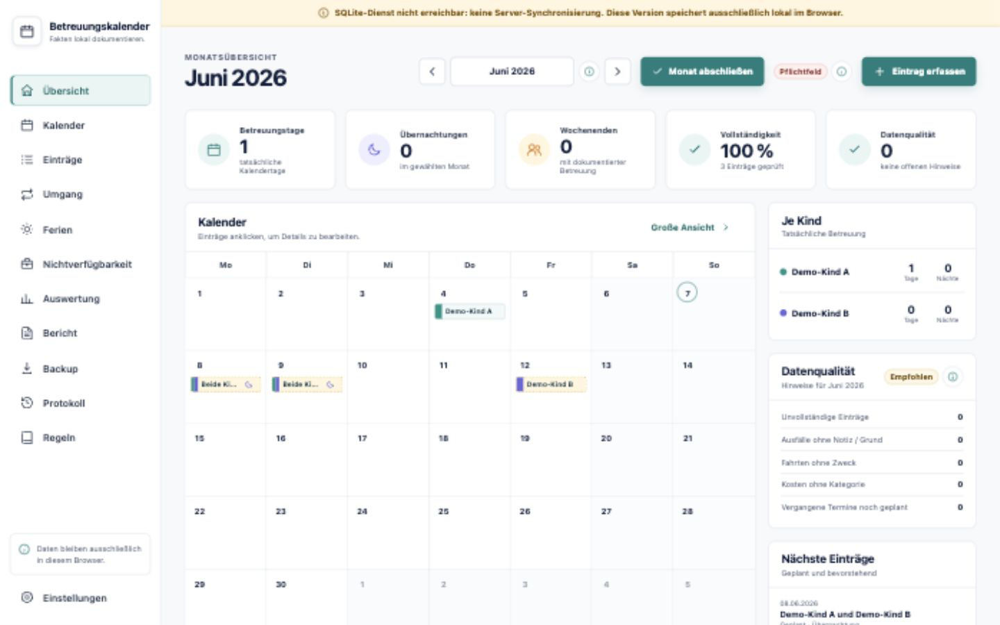

# Betreuungskalender

Betreuungskalender is a self-hosted React/TypeScript application for neutral,
traceable documentation of planned and actual childcare periods, related
travel, costs, holidays, and unavailable periods.

> **Status:** Initial public preview. The application is intended for private,
> self-hosted documentation. It does not provide legal advice, create an
> official record, or guarantee that generated material will be accepted by a
> court, authority, lawyer, or other recipient.

## Project status

- Latest release: [v0.1.0 initial public preview](docs/release-notes/v0.1.0.md)
- Prepared release: [v0.3.0 SQLite persistence and legacy migration](docs/release-notes/v0.3.0.md)
  (not published until the `v0.3.0` tag and GitHub release are created)
- Current `main`: SQLite/API domain persistence, legacy browser-data migration,
  responsive mobile support, backup/restore tooling, and deployment guidance
- Roadmap and work tracking: [GitHub milestones and issues](https://github.com/hackepeter87/betreuungskalender/milestones)
- Stability target: `v1.0.0`

## Screenshot



Example dashboard using fictional demonstration data. No real personal data is
included in repository screenshots.

[Features](#features) · [Development](#development-quick-start) ·
[Container](#container-quick-start) · [systemd/LXC](#lxcsystemd-quick-start) ·
[Configuration](docs/configuration.md) · [Security](docs/security.md) ·
[Backup](docs/backup-restore.md) · [Legacy migration](docs/migration.md)

## Features

- Children, planned/completed/cancelled care entries, factual cancellation
  reasons, overnight stays, handovers, locations, notes, and evidence references
- Mobile agenda, tablet/desktop calendar, responsive forms, PWA manifest, and
  touch-friendly help for all input fields
- Configurable biweekly Friday-to-Sunday target schedule and
  planned-versus-actual analysis
- Additional care, holiday blocks and allocation, and actual holiday statistics
- Duty-related and other unavailable periods with overlap notices
- Multiple trips and costs per care entry with period statistics
- Monthly closure, data-quality checks, soft delete, and field-level audit log
- JSON backup/import, separate CSV exports, neutral PDF report, and A4 print view
- Fastify API with SQLite, migrations, validation, auth-proxy support, health
  endpoints, and production security headers

The application documents user-entered facts and does not evaluate another
person's conduct.

## Architecture and data storage

```text
React + TypeScript + Vite
        |
        +-- Fastify API
                |
                +-- SQLite (domain source of truth)
```

The browser UI loads and stores children, care entries, holidays, contact
patterns, trips, costs, unavailable periods, settings, monthly closings, and
audit records exclusively through the API in SQLite. `localStorage` is not
used for current domain persistence. When the API is unavailable, the
application displays a server error and blocks write actions.

Existing data from older browser-only versions is read solely as a legacy
migration source. The [migration assistant](docs/migration.md) previews the
data, identifies potential duplicates and conflicts, and imports it
transactionally into SQLite.

There is no cloud synchronization, analytics, or external tracking.

## Development quick start

Requirements: Node.js 22 LTS, npm, and a build environment supported by
`better-sqlite3`.

```bash
npm ci
cp .env.example .env
```

Change `.env` for local development:

```dotenv
NODE_ENV=development
HOST=127.0.0.1
PORT=3000
DATABASE_PATH=./data/app.sqlite
BACKUP_DIR=./backups
REQUIRE_AUTH=false
TRUST_PROXY_AUTH=false
ALLOWED_ORIGIN=http://localhost:5173
LOG_LEVEL=debug
```

Then start:

```bash
npm run dev
```

- Frontend: `http://localhost:5173`
- API: `http://127.0.0.1:3000`
- Health: `http://127.0.0.1:3000/api/health`

Full instructions: [docs/installation.md](docs/installation.md)

## Production build

```bash
npm ci
npm run lint
npm run test
npm run build
NODE_ENV=production npm run start
```

`npm run start` serves the built frontend and `/api` from one Fastify process.
Migrations run at startup.

## Container quick start

```bash
docker compose build
docker compose up -d
curl --fail http://127.0.0.1:3000/api/health
```

The included Compose configuration binds only to loopback, uses persistent
named volumes for `/data` and `/backups`, and starts without authentication for
local evaluation. Enable external authentication before any network exposure.

Docker and rootless Podman instructions:
[docs/deployment-container.md](docs/deployment-container.md)

## LXC/systemd quick start

Recommended paths:

- Application: `/opt/betreuungskalender`
- SQLite: `/var/lib/betreuungskalender/app.sqlite`
- Backups: `/var/backups/betreuungskalender`
- Configuration: `/etc/betreuungskalender/.env`

After installing and building as the dedicated `betreuung` account:

```bash
sudo cp docs/systemd/betreuungskalender.service /etc/systemd/system/
sudo systemctl daemon-reload
sudo systemctl enable --now betreuungskalender
curl --fail http://127.0.0.1:3000/api/health
```

Complete guide: [docs/deployment-lxc.md](docs/deployment-lxc.md)

## Configuration

All settings are environment based. `.env.example` contains production-shaped
example values using `example.net` only.

Key variables:

| Variable | Typical production value |
| --- | --- |
| `DATABASE_PATH` | `/var/lib/betreuungskalender/app.sqlite` |
| `BACKUP_DIR` | `/var/backups/betreuungskalender` |
| `REQUIRE_AUTH` | `true` |
| `TRUST_PROXY_AUTH` | `true` behind a trusted proxy only |
| `ALLOWED_ORIGIN` | `https://betreuung.example.net` |
| `LOG_LEVEL` | `info` |

Every variable, default, and security implication is documented in
[docs/configuration.md](docs/configuration.md).

## Authentication and reverse proxy

Local mode:

```dotenv
REQUIRE_AUTH=false
TRUST_PROXY_AUTH=false
```

Protected mode behind oauth2-proxy:

```dotenv
REQUIRE_AUTH=true
TRUST_PROXY_AUTH=true
```

The API then requires one of the supported trusted identity headers. These
headers can be forged if users can reach the app directly, so the app port must
be private or bound to loopback.

- HAProxy, nginx, Caddy, and Traefik:
  [docs/reverse-proxy.md](docs/reverse-proxy.md)
- Detailed Keycloak and oauth2-proxy setup:
  [docs/keycloak-oauth2-proxy.md](docs/keycloak-oauth2-proxy.md)

## Health and readiness

```bash
curl http://127.0.0.1:3000/api/health
curl http://127.0.0.1:3000/api/ready
npm run healthcheck
```

Health output includes status, application version, database reachability, and
timestamp. It does not expose database paths or secrets.

## Backup and restore

Create and verify an online-safe SQLite backup:

```bash
npm run backup
npm run restore:check
```

The script uses SQLite's backup API, stores restrictive files in `BACKUP_DIR`,
and removes backups older than `BACKUP_RETENTION_DAYS` (default 14). Keep
additional encrypted off-host generations.

The in-app JSON export contains the complete domain data loaded from SQLite and
can be restored transactionally through the API. A verified SQLite backup
remains the authoritative operational and disaster-recovery backup. CSV and
PDF files are reporting formats, not complete backups.

Restore procedure and testing:
[docs/backup-restore.md](docs/backup-restore.md)

## Updates

Before every update:

1. Export JSON from the application.
2. Create and verify an SQLite backup.
3. Read `CHANGELOG.md`.
4. Install exact dependencies with `npm ci`.
5. Run build and tests.
6. Restart, check health, and perform a UI smoke test.

Rollback details: [docs/update.md](docs/update.md)

## Mobile, iPhone, iPad, and PWA

- iPhone uses a compact agenda and safe-area-aware bottom navigation.
- iPad and desktop retain calendar and side navigation layouts.
- Forms use native date/time inputs and touch targets.
- Export actions are available on mobile; saving behavior depends on the iOS
  browser and Files/Share Sheet.
- The service worker provides an offline frontend shell. It does not imply a
  successful server write while the API is unavailable.

## Exports and reports

- JSON: complete domain export/import of the SQLite-backed application data
- CSV: care entries, trips, costs, holidays, and unavailable periods
- PDF: neutral selected-period report with report ID, data state, statistics,
  daily list, notes, cancellation reasons, and optional audit history

Exports can contain sensitive personal data. Store them encrypted and never
attach them to public GitHub issues.

## Privacy and security

SQLite files, backups, exports, and reports may contain
sensitive family data. The operator is responsible for:

- TLS and authentication
- Host and dependency updates
- Firewall and reverse-proxy correctness
- Disk encryption and filesystem permissions
- Backup encryption, retention, restore tests, and deletion
- Restricting access to the application host and generated files

See [docs/security.md](docs/security.md) and [SECURITY.md](SECURITY.md).

## Legal and evidentiary limits

The app is a documentation aid, not an official record. Audit history, report
IDs, monthly closure, and backups improve internal traceability but do not
create a qualified signature, trusted timestamp, or tamper-proof archive.

Read the full [legal disclaimer](docs/legal-disclaimer.md).

## Release Check

Before a release, verify that the repository contains no local databases,
exports, backups, or secrets:

```bash
npm run release:check
npm run release:check:strict
```

The check blocks real artifacts such as `.sqlite`, `.db`, `.pdf`, `.csv`,
`.env`, and backup/export JSON files. Source and documentation files whose
names contain words such as `backup` or `export` remain allowed.

The strict command additionally requires a clean working tree, checks that the
release tag is available, and runs build, lint, and tests. See the complete
[release workflow](docs/release.md).

## Project checks

```bash
npm run lint
npm run test
npm run build
npm run release:check
```

CI runs install, static checks, tests, and production build. A separate workflow
checks the container image.

## License

Licensed under the [MIT License](LICENSE).

## Contributing and support

Read [CONTRIBUTING.md](CONTRIBUTING.md) and
[CODE_OF_CONDUCT.md](CODE_OF_CONDUCT.md) before contributing.

Use GitHub Issues for bugs and feature requests. Never post real names,
addresses, schedules, court documents, screenshots with personal data,
backups, SQLite files, PDFs, CSVs, authentication tokens, or secrets.
